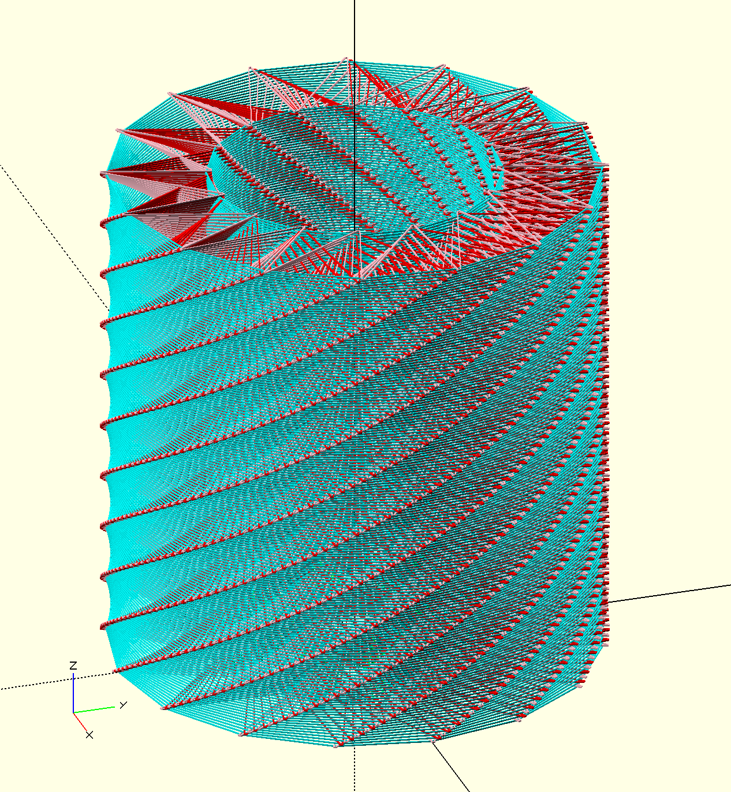
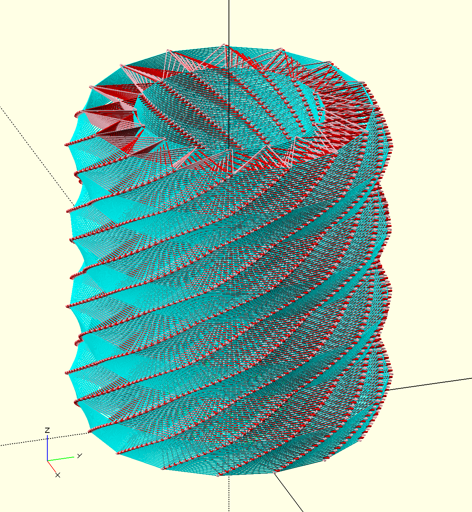
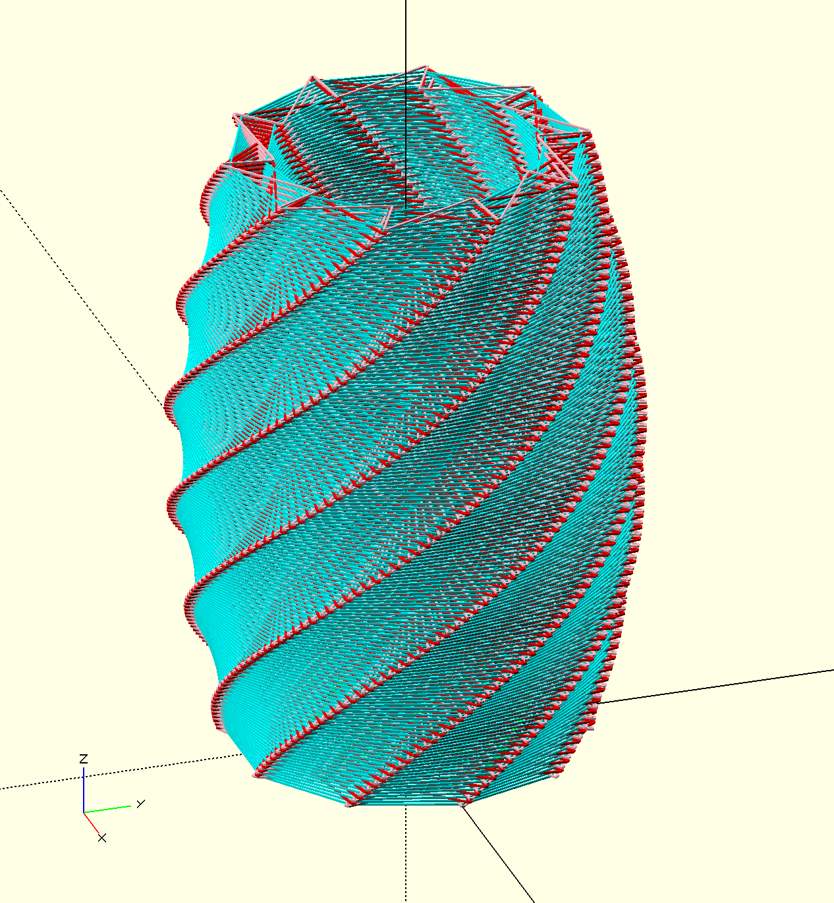
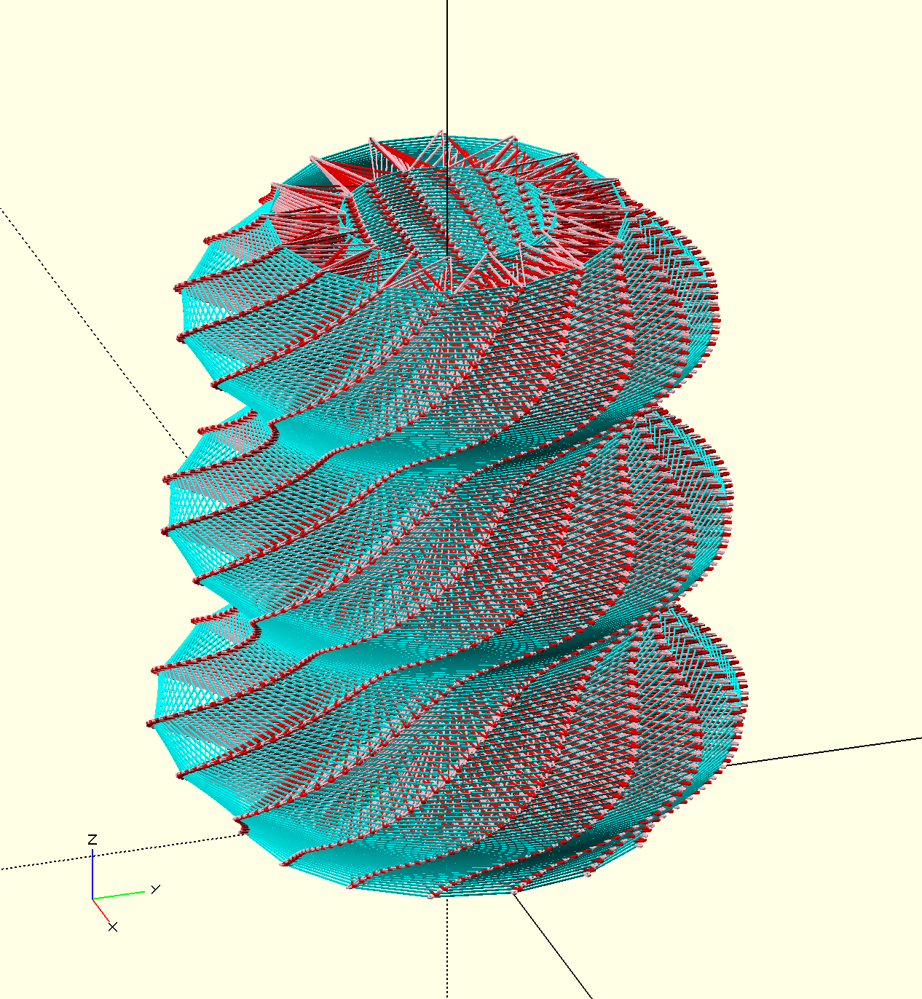

# Adjustable *Re*orbital: Print-in-place Lamp

This model reimplements the [Orbital](https://www.prusaprinters.org/prints/41007-orbital-structural-printing-print-in-place-lamp) lampshade that won Prusa Printers' competition in 2020, but with three changes:

1. This implementation uses OpenSCAD, so the parameters maybe adjusted.  The height and number of sides is straightforward.

2. The inner and outer radius can be defined using a function, allowing various curves and waves to be used.

3. The original model has some very minor flaws leading to defects (incorrect sequence of the inner star shape; it is sometimes with the circles and sometimes with the outer star shape).  These are no longer present.






## Model generation

The main code is in [reorbital.scad](./reorbital.scad), and four example files produce different styles:

* [straight-reorbital.scad](./straight-reorbital.scad) makes a straight-sided lamp, as with the original.
* [zigzag-reorbital.scad](./zigzag-reorbital.scad) has a zig-zag side and a straight inner core.
* [bulge-reorbital.scad](./bulge-reorbital.scad) has a slight bulge on the outside.
* [curves-reorbital.scad](./curves-reorbital.scad) has three curves defined on the outside, and a single curve on the inside.

I have only tested printing the straight and bulge designs.

The initial parameters in the OpenSCAD file may be edited, to adjust the height, layer thickness, rotation effect and so on.

When changing the parameters, consider:

* More points or a thicker lampshade will reduce the amount of light seen through the lampshade
* Different filament will also change this, e.g. transparent PETG vs a natural PLA
* Rapid slope changes might make an unreliable or impossible print

## Seam locations

*This may no longer be necessary with current slicers.*

For the best results, configure the seams (starts and ends of each layer's printing) to be in a set location.

To do this, generate the model as a multi-part 3MF file using [ColorSCAD](https://github.com/jschobben/colorscad):

```sh
colorscad.sh -i orbital.scad -o orbital-with-seams.3mf
```

Rendering the model takes a long time.

Unzip the 3MF file, and go to the smaller `<triangles>` section resulting from the black colour add the attribute `slic3rpe:custom_seam="4"` is to every triangle:

```xml
<triangles>
    <triangle v1="0" v2="1" v3="24" slic3rpe:custom_seam="4" />
    <triangle v1="0" v2="24" v3="6" slic3rpe:custom_seam="4" />
    <triangle v1="1" v2="0" v3="6" slic3rpe:custom_seam="4" />
    …
```

Repack the file, and the painted seams should then show up in PrusaSlicer.

An alternative to using ColorSCAD is to comment out and render each part (lamp + seams) separately, combine them in PrusaSlicer, then modify as above.

## Print settings (Prusa)

Using the PrusaSlicer defaults:

* 0.30mm DRAFT is the basis
  * First layer height: 0.3mm
  * Detect thin walls: on (if using classic perimeter generation)
  * Detect bridging perimeters: off
  * Speed for non-print moves → Travel is 45mm/s

* Original Prusa i3 Mk3S & Mk3S+ is the basis
  * Maximum acceleration Y: 300mm/s
  * Maximum jerk Y: 3mm/s

Reducing the speed, acceleration and jerk is supposed to stop the print from wobbling — the lamp is like a large spring once it reaches a certain height. The non-print move speed is the most important.

## Print settings (Bambu)

Using the Bambu Slicer defaults:

* 0.28mm Extra Draft @BBL X1C with Generic PLA
  * Initial layer height: 0.28mm
  * Line widths all set to 0.45mm
  * Wall loops: 4
  * Top/Bottom surface pattern: Concentric
  * Sparse infill density: 0%
  * Speed outer/inner wall: 65mm/s
  * Travel speed: 300mm/s
  * Normal printing acceleration: 300mm/s
  * Travel acceleration: 300mm/s
  * Initial layer acceleration: 100mm/s

Some of these settings changes were carried over from the Prusa Mk3S+, and are probably not necessary.
